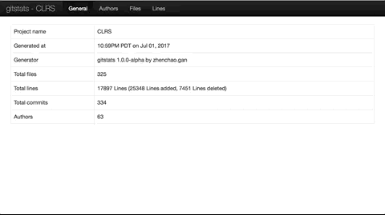

# gitstats
Create visual stats for you repo. Following is the result of my [CLRS](https://github.com/gzc/CLRS) repo



***

## Dependencies
```
pip install pandas
pip install yattag
```

## Usage
Generate your repo log
```
git log --stat --no-merges --summary > repo_log
```

Run script with the generated log
```
cd gitstats/v1
python main.py projectName repo_log
```

***
Follow [@Zhenchao Gan](https://github.com/gzc) on github to help finish this task.
