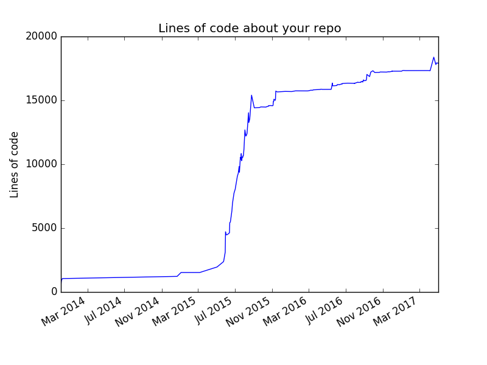

# gitstats
Create visual stats for you repo.
This is a picture generated by gitstats for my [CLRS](https://github.com/gzc/CLRS) repo



***

## Dependencies
```
pip install pandas
pip install yattag
```

## Usage
```
git log --stat --no-merges --summary > tmp
python main.py tmp
```

## V 0.1.0-alpha
06/10/2017
1. Basic info per user, like commit numbers and lines of changes.
2. Provide Lines of Code vs. time image.

***
Follow [@Zhenchao Gan](https://github.com/gzc) on github to help finish this task.
